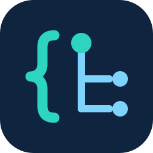

# OAS Buddy



[](https://github.com/maddingo/oas-buddy/actions/workflows/ci.yml)

A desktop editor for OpenAPI Specification (OAS) documents.

See [CLAUDE.md](CLAUDE.md) for the full project vision, MVP scope, and architecture decisions.

## Branding

The app icon and its palette live in [docs/branding/](docs/branding/). `oas-buddy-icon.svg` is the
single hand-edited source; every other icon file is generated from it by `tools/generate-icons.sh`.

## Modules

- `oas-buddy-core` — document model, file I/O, and validation. No UI dependencies.
- `oas-buddy-desktop` — JavaFX desktop application.

## Requirements

- Java 25 and Maven, pinned via [mise](https://mise.jdx.dev/) (`mise install`).

## Build and run

```
mvn test                        # run all tests
cd oas-buddy-desktop
mvn javafx:run                  # run the desktop app
```

The `javafx:run` plugin prefix only resolves correctly when Maven is invoked from inside
`oas-buddy-desktop` itself; running it from the repo root via `-pl oas-buddy-desktop -am` fails
with "No plugin found for prefix 'javafx'".

**Running from an IDE:** run `no.maddin.oasbuddy.desktop.Launcher`, not `MainApp`, as the main
class. `MainApp` extends `javafx.application.Application` directly, and the JVM refuses to launch
a main class that does that from a plain classpath (no module-path) — even with the JavaFX jars
present — failing with "JavaFX runtime components are missing". `Launcher` is a plain class that
delegates to `MainApp`, which sidesteps that check.

## Packaging a native installer

```
cd oas-buddy-desktop
mvn -Djpackage package     # builds the installer(s) for whichever OS you're on
```

Produces, in `oas-buddy-desktop/target/dist/`:

| OS | Output |
|---|---|
| Linux | `.deb`, `.rpm`, and a portable app-image (own JVM, no installer) |
| macOS | `.pkg` |
| Windows | `.exe` |

The Linux app-image is for direct download/manual install, and the future fetch target for an
AUR `-bin` package on Arch/CachyOS (real AUR packaging isn't set up yet). The `package.yml`
workflow tars it as `oas-buddy-linux-x86_64.tar.gz`.

Each installer bundles its own JVM, so the target machine doesn't need Java installed. This is
opt-in (`-Djpackage`) and only activates for the OS you're actually running on, so a plain
`mvn package` is unaffected.

Requires the OS-native packaging tool to be installed: `dpkg-deb`/`rpmbuild` on Linux, Xcode
command line tools on macOS, or the [WiX Toolset](https://wixtoolset.org/) on Windows — all
preinstalled on GitHub's hosted runners except `rpmbuild`. The `.github/workflows/package.yml`
workflow builds all four installers across an OS matrix; trigger it manually or by pushing a `v*`
tag.

## Releasing

Versions are CI-friendly (`${revision}`, default `0.1.0-SNAPSHOT`) — the POMs never carry a real
version, so there's nothing to bump in git. To cut a release, run the **Release** workflow
(Actions tab → Release → Run workflow) with a version like `1.2.0`. It tags `v1.2.0` and pushes
it; that tag push triggers `package.yml`, which builds the installers with that version baked in
and attaches them to the GitHub Release for `v1.2.0` (created automatically).
